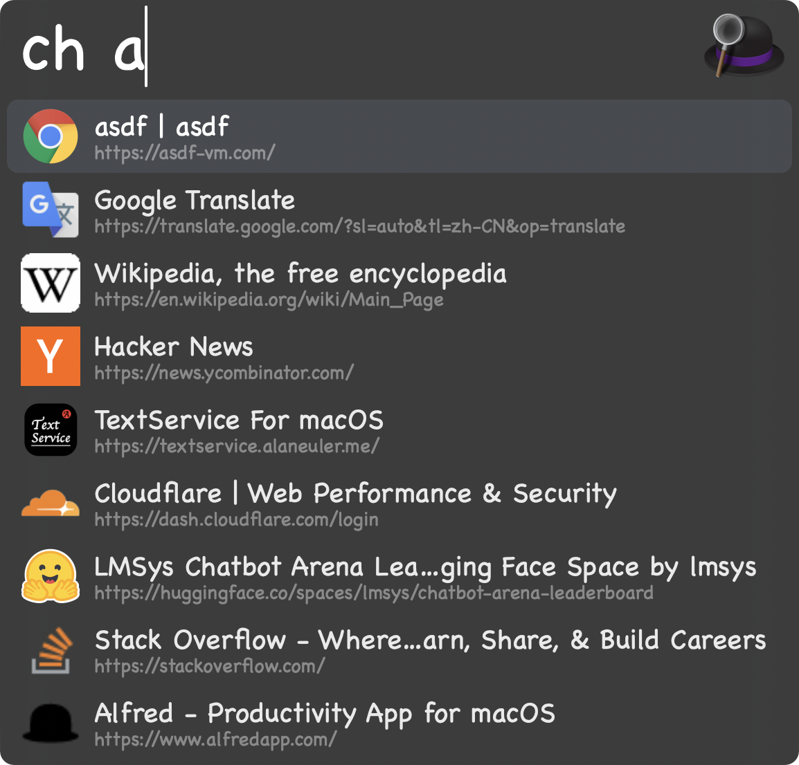

# Chrome History Alfred Workflow
Search Chrome history and open in browser (the searching includes title and URL).

Key word `ch`:

> Note: this projects uses the URLs to load favicons (because the bitmaps resolution in SQLite DB is too low), so:
> - Network access is needed.
> - Need some time to load for the first use.

## Profile
1. Open workflow in Alfred preferences
2. Open Configuration dialog at the upper right (looks like `[x]`)
3. Set `CHROME_PROFILE` variable value such as `Profile 1` in Environment Variables tab
